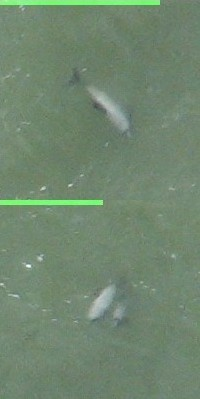

# Maui63 computer vision

All the things related to processing imagery from our drone/plane surveys. We're specifically focusing on our new [multi-camera solution from a Cessna 172](doc/multi-camera-setup.md) and looking for [Maui's dolphins](https://en.wikipedia.org/wiki/M%C4%81ui_dolphin) with computer vision i.e. like this:

Specifically, this repo includes:

- Models for detecting small (50 pixel) dolphins from 61MP images.
  - Using SAHI to tile to improve performance.
  - Basic workflows to run inference on surveys and review.
  - Various notebooks floating around for creating training datasets etc.
- Various notebooks related to post-processing our raw data and tidying it up, and an app to review our multi-camera solution.

## Future ideas

- Can afford to train a new model now we've got more data. That is:
  - New model architectures e.g. yolov12 is a thing now. If we can go faster, and possibly real-time, without sacrificing accuracy, great.
  - Play with different tiling size - 640x640 was just a first guess.
  - SAHI is yuck, just roll our own, it's pretty basic, and we can optimise it a bit.
- Maybe try some ensembles? Slightly different data prep etc.
- Do some investigation on detections so far:
  - Do they tend to be at the front of the image (indicating they dive)?
  - Is there a higher density in the middle of the image i.e. we're missing more at the far left/right?