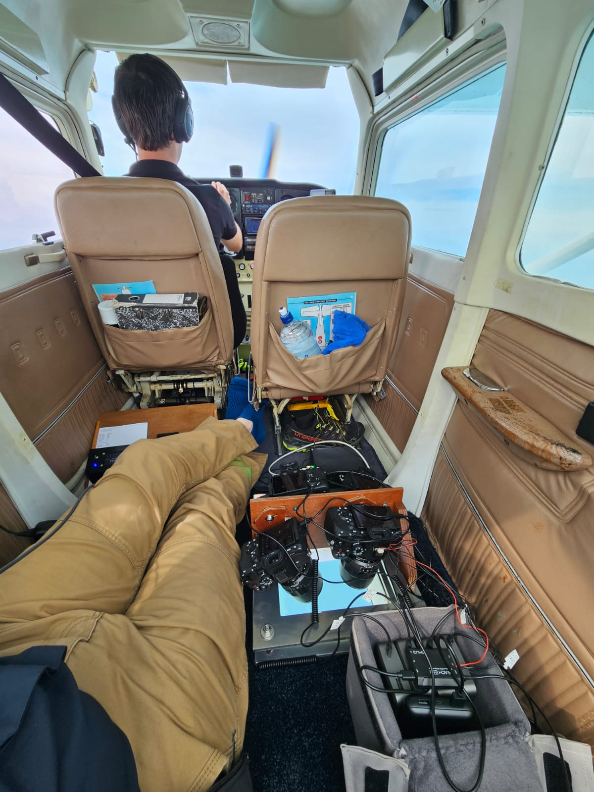

# Multi camera setup

## Objective

Capture a large area cheaply. Drones aren't cheap. Nor are aerial surveys.

## (Theoretical) solution
Sure, just stick heaps of cameras in a plane. We were targeting a 2.5cm GSD at 1km swathe, which is 40,000 horizontal pixels. Top of the line standard DSLRs like the Sony A7R V are 61mp (9504 pixels wide), which means 4x of these gets us our answer. In theory.

## Considerations

In practice:
- We don't want to exceed 30-40 degrees viewing angle at the edge as that reduces detection likelihood and target size. Therefore we've got to be flying high - about 2500 feet. This means:
  - We need long focal length lens.
  - We need to be careful with motion and vibration blur with long focal length. Vibration dampening and securely mounting the cameras/lens help with the latter, and higher shutter speeds with the former.
- With our given configuration, dolphins at the edge are about 50% smaller (40px) than dolphins directly under the plane (60px). This is acceptable.
- Putting holes in planes (legally) is expensive. We found a partner (Action Aviation) with a Cessna 172 with a hole in the belly. Only problem was it's a very small hole, and we not only had to squish 4 cameras in there, but ensure that the outer edge ones had full visibility.
- Cameras are expensive. We tried renting some, and lens. Ultimately, it made sense to buy them, and to get the same model to keep things simpler and consistent.
- Camera batteries won't be sufficient for a 4 hour flight. We need (reliable) external power.

## So, the (current) solution

Hardware:

- Cessna 172 with hole in the belly for surveying.
- 4x Sony A7R V - 61mp, solid performer.
- 4x Voigtlander 110mm f/2.5 MACRO APO-LANTHAR Lens : Sony FE. Good optics, small and light which is important for mounting.
- 4x power banks + dummy batteries to keep the cameras running. Each camera takes 3-4k shots per flight.
- 8x 512mb SD cards. Each image over the ocean is about 45mb (depending on conditions), so we can easily hold enough from a single day of flying (8 hours including off effort) at 2 second intervals.
- Camera mount. As you can see, the hole in the belly is pretty small, so not only do the cameras (and lens) have to fit, but they have to be able to see sideways without seeing the bottom skin of the fuselage. This configuration works well - the cameras are held firmly in place (on the lens too) near their centre of mass to keep things stiff. Current prototype is marine ply, but plan is for aluminium.
- Triggering system + GPS. Custom micro that triggers all 4 cameras at the same time, and records the GPS position.

We settled on JPG as it's easier to work with than RAW, and so far we haven't seen a need for using RAW.

Post processing involves pulling the frames of the SD cards, matching each frame up with the GPS triggers (which gets hard when e.g. we had one camera go offline for a minute), running through the model (using a very low threshold to make it sensitive), then filtering out false positives.

## Current issues

- We have unusual image softness issues - sometimes only parts of the image will be soft, and other parts sharp. Next frame it'll be gone. It could be vibration, or it could be exhaust from the plane - though neither of these really make sense. It's not a major issue, but would be good to resolve.
- We've no way to avoid sun glint.
- We can't easily review images live - check focus etc.
- We can't avoid sun glint.
- We don't have a solution for lots of data beyond buying more SD cards.

## Future ideas

- Build some fore/aft tilt to the mount so we can avoid sun glint if necessary. Potentially motorised. We'll cut it out of aluminium.
- Get full res images off the cameras live (if we can) and process them live in the plane. Why?
  - We can detect image issues e.g. sun glint. Pilot can attempt to account for this, or (if we have fore/aft tilt) we could handle it automatically.
  - We can detect dolphins live. The pilot can then circle and get multiple images. This is useful for getting more training data but also e.g. estimating the availability of the dolphins.
  - Reduces the need to synchronise the images after the fact. The host computer would know "I just got all these 4 images at the same time at this GPS location" and we wouldn't have to worry about syncing them up on filenames, datetimes, etc.
  - We can save straight to hard drives, which removes the need to handle many little SD cards afterward.
  - Could reduce the need for a second person on the flight. The pilot could have a HUD with some intelligent alerting etc.
- We might get a local computer for inference - working with a terabyte of images a day gets tricky without fast internet ... and we probably won't have that if the team are doing an extended survey in a remote area with limited comms.
